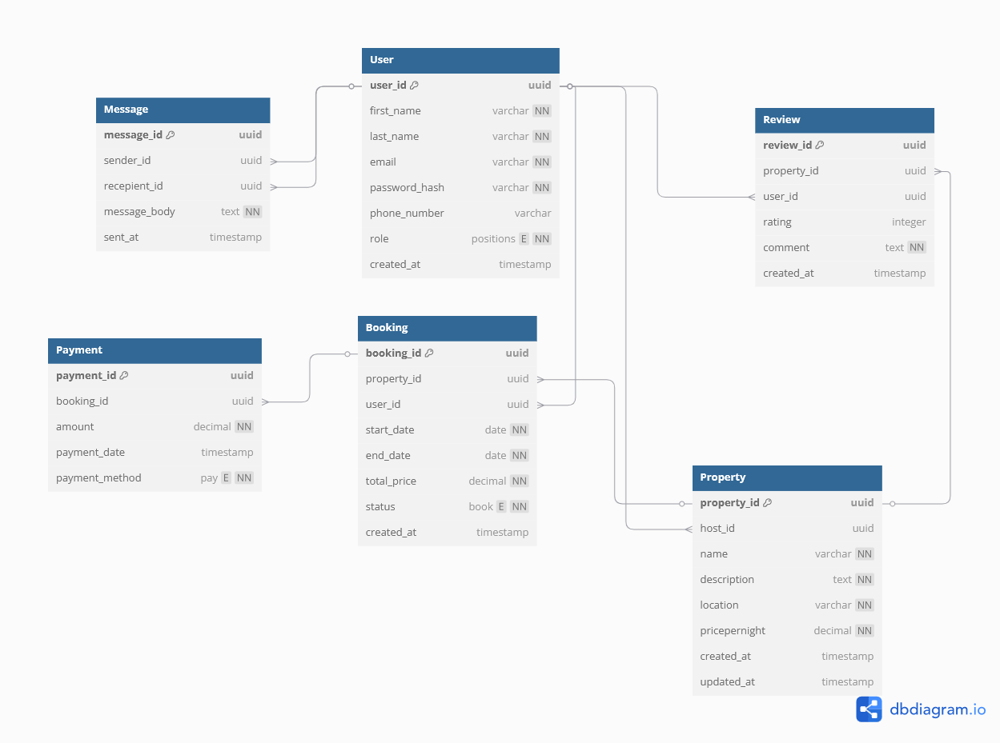

# ENTITY RELATIONSHIP DIAGRAM (ERD)

## Entities and Attributes

### User
- user_id
- first_name
- last_name
- email
- password_hash
- phone_number
- role
- created_at

### Property
- property_id
- host_id
- name
- description
- location
- pricepernight
- created_at
- updated_at

### Booking
- booking_id
- property_id
- user_id
- start_date
- end_date
- total_price
- status
- created_at

### Payment
- payment_id
- booking_id
- amount
- payment_date
- payment_method

### Review
- review_id
- property_id
- user_id
- rating
- comment
- created_at

### Message
- message_id
- sender_id
- recepient_id
- message_body
- sent_at

## Relationships
- A __user__ can __book__ a __property__
- A __booking__ can be made on a __property__
- A __review__ can be made on a __property__
- A __message__ can be sent from one __user__ to another
## Entity Relationship Diagram (ERD)

